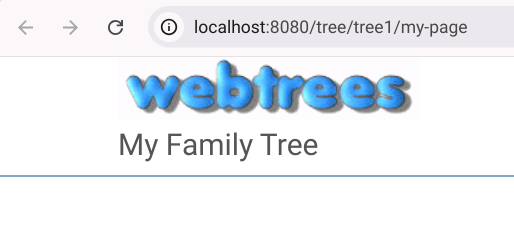

# webtrees Local (Online genealogy)

[
](LICENSE.txt)

> **This container is for local use only and not suitable for production environments.**

<p align="center">
  
</p>

This is a containerized version of [webtrees](https://github.com/fisharebest/webtrees), a collaborative online genealogy application.

## Usage

To start the webtrees application on port `8080/tcp`, run:

```shell
docker run --name webtrees-local -p 127.0.0.1:8080:80/tcp webtrees-local:latest
```

The container [supports a SQLite](https://webtrees.net/install/requirements) database.

### Data Directory

The webtrees application is located in `/var/www/webtrees`. You can mount a directory from your host to the `/var/www/webtrees/data` directory in the container to access configuration files and other data.

## Build

To build the container, follow these steps:

```shell
# Clone the repository
git clone https://github.com/rwanyoike/webtrees-local-docker
# Navigate to the project directory
cd webtrees-local
# Build the container
docker build -t webtrees-local:latest .
```
